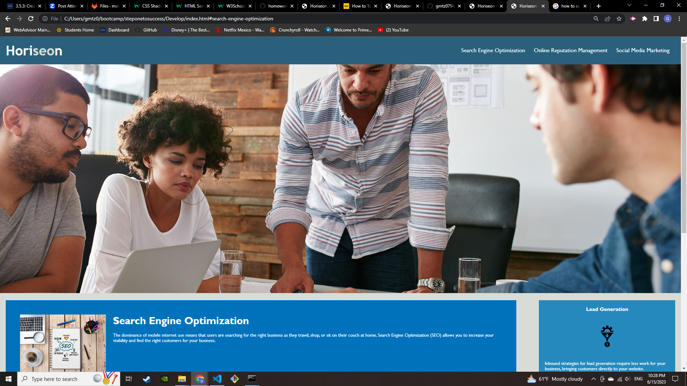

# <Step one to success>

## Description

My motivation to create this project is to reinforce the knowledge I have acquired in the first two weeks of my coding bootcamp. There was issues when I tried to rearrange some HTML and CSS elements, but going through my lectures and doing research I was able to make the necessary adjustments to my starter code. I learned even further the utilization of several HTML elements as well as styling with CSS.

## Usage

By using the Heriseon website users are able to get information from the search engines on the top. This consequently takes the user to specific sections of the website.

